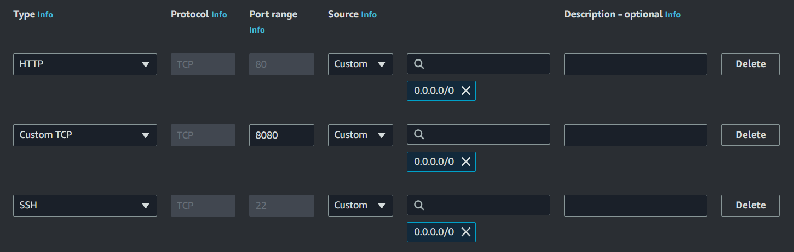

<!-- WiP @athletedecoded -->
# Automate Binary Builds with Jenkins + CodePipeline

NB: If you have an existing EC2 instance from [Hello, Candle! on AWS](./hello-aws.md), skip to [Connect EC2 with Jenkins](#connect-ec2-with-jenkins)

## Setup AWS EC2 Compute Instance

**Launch GPU Enabled AWS EC2 Compute Instance**

1. Open the AWS EC2 Console
2. Configure a Ubuntu 20.04 Deep Learning Base GPU AMI image + G5.##xlarge instance type (see [here](https://aws.amazon.com/ec2/instance-types/g5/) for charges and instance capcity) 
3. Create new key pair and save .pem file
4. Allow SSH traffic
5. Launch Instance
6. From EC2 landing page >> Start Instance

*Gotchas*
* You may need to request capacity increase from AWS to handle larger G5.##xlarge instances
* Move .pem file from downloads to ~/.ssh using `mv ~/Downloads/candle-key.pem ~/.ssh`

**Connect to EC2 via SSH**

1. Install [Remote - SSH](https://code.visualstudio.com/docs/remote/ssh) from VSCode Extensions
2. Add new SSH Connection
3. From EC2 landing page >> Connect >> SSH client >> Copy command to VSCode
  ```
  ssh -i "candle-key.pem" ubuntu@ec2-##-##.us-east-21.compute.amazonaws.com
  ```
4. Update .config file and validate format as follows

  ```
  Host ec2-##-###.us-east-1.compute.amazonaws.com
    HostName ec2-##-###.us-east-1.compute.amazonaws.com
    IdentityFile ~/.ssh/candle-key.pem
    User ubuntu
  ```
5. Confirm instance type (Linux) and fingerprint (Yes) 
6. Launch terminal on remote host


**Verify EC2 CUDA/cuDNN**

```
nvidia-smi --query-gpu=compute_cap --format=csv
nvcc --version

whereis cudnn.h
```

**Install Rust via [rustup](https://rustup.rs/)**

```
# see https://rustup.rs/
curl --proto '=https' --tlsv1.2 -sSf https://sh.rustup.rs | sh

# Set path
source "$HOME/.cargo/env"
```

**Install AWS CLI**

```
curl "https://awscli.amazonaws.com/awscli-exe-linux-x86_64.zip" -o "awscliv2.zip"
unzip awscliv2.zip
sudo ./aws/install

# Check install
aws --version
```

## Connect EC2 with Jenkins

**Add Security Group to EC2**

1. From EC2 landing page >> Network & Security >> Security Groups 
2. Create Security Group >> Name: "WebConnectEC2" >> Description: "Allow SSH and HTTP traffic to EC2"
3. Add the following inbound rules. NB: Source = "Anywhere" is not recommended for production environments.

  

4. Click EC2 instance >> Actions >> Networking >> Change Security Groups >> Select "WebConnectEC2" >> Save

**Install Jenkins on EC2**

```
curl -fsSL https://pkg.jenkins.io/debian-stable/jenkins.io-2023.key | sudo tee \
  /usr/share/keyrings/jenkins-keyring.asc > /dev/null
echo deb [signed-by=/usr/share/keyrings/jenkins-keyring.asc] \
  https://pkg.jenkins.io/debian-stable binary/ | sudo tee \
  /etc/apt/sources.list.d/jenkins.list > /dev/null
sudo apt-get update
sudo apt-get install jenkins

# Check install
jenkins --version

# Allow Jenkins service to start at boot
sudo systemctl enable jenkins

# Launch Jenkins
sudo systemctl start jenkins
```

**Configure Jenkins**

1. Click EC2 instance >> Details >> Copy Public IPv4 DNS
2. From browser http://<public_ipv4_address>:8080/
3. From EC2 SSH terminal >> `sudo cat /var/lib/jenkins/secrets/initialAdminPassword` >> Copy password


## References
* [Install Jenkins to EC2](https://www.jenkins.io/doc/book/installing/linux/#debianubuntu)
* [Jenkins on AWS](https://www.jenkins.io/doc/tutorials/tutorial-for-installing-jenkins-on-AWS/#installing-and-configuring-jenkins)
* Create User "Candle-EC2" with EC2 Full access + ECR --> jenkinsAccess key